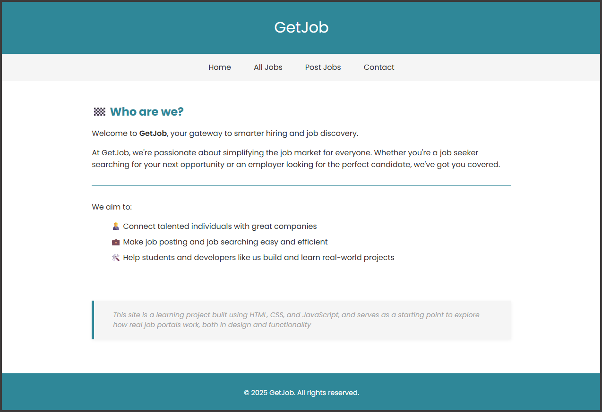
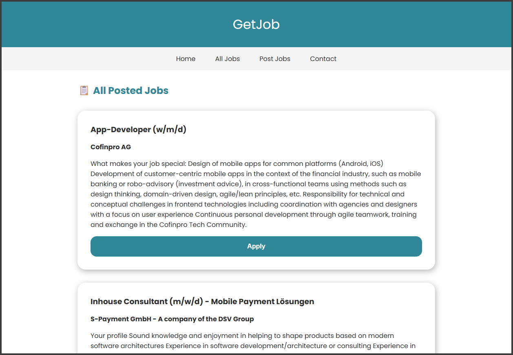
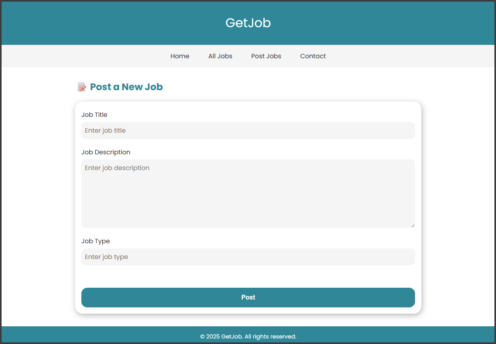

# 💼 GetJob

A simple, responsive job posting and job-seeking website built using **HTML**, **CSS**, and **JavaScript**.  
This project is created as a learning tool to understand how job portals work—both in **design** and **functionality**.

---

## 📸 UI Preview

| Home Page |
|-----------|
|  |

| All Jobs Page |
|---------------|
|  |

| Post Job Page |
|---------------|
|  |

---

## 🛠 Features

- Post a job with fields like title, company, description, and type
- View all jobs in a card layout
- Responsive design using Flexbox and CSS Variables
- Custom UI components like cards, buttons, and modals
- Form validation and interaction via JavaScript

---

## 🧩 Built With

- HTML5
- CSS3 (with variables and custom components)
- JavaScript (Vanilla)
- Google Fonts
